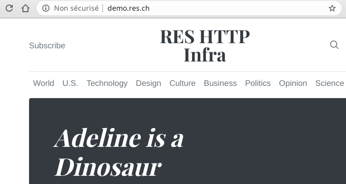

# RES - Laboratoire infrastructure HTTP

> Auteurs: Gil Balsiger et Julien Béguin  
> Date: 01.05.2020


## Step 1: Serveur HTTP statique avec NGINX

Nous avons choisi ici d'utiliser NGINX comme serveur HTTP celui étant un peu plus moderne et plus performant qu'Apache httpd.

On utilise l'instruction Dockerfile `COPY` pour copier notre site web statique dans le conteneur NGINX à l'emplacement racine du serveur web.

Nous avons utilisé un template HTML utilisant le framework CSS Bootstrap: [https://getbootstrap.com/docs/4.4/examples/](https://getbootstrap.com/docs/4.4/examples/).

Le Dockerfile est disponible [ici](Step_1/Dockerfile).


## Step 2: Serveur HTTP dynamique avec [NestJS](https://nestjs.com/)

Nous avons choisi dans cette étape d'utilisé NestJS au lieu de Express JS. NestJS est un framework inspiré d'Angular mais fonctionnant coté serveur à l'instar d'Angular qui, lui, fonctionne coté client.

Le code de l'application ainsi que le Dockerfile sont disponibles [ici](Step_2).

On peut build et lancer l'image avec les commandes suivantes: 
```
docker build -t http-step2 ./Step_2 
docker run --rm -p 3000:3000 http-step2
```

L'application permet de générer aléatoirement 20 animaux à l'adresse [http://localhost:3000/](http://localhost:3000/).

L'application permet également de générer aléatoirement un nombre spécifique d'animaux en mettant le nombre voulu dans l'URL: [http://localhost:3000/200](http://localhost:3000/200) pour générer 200 animaux.


## Step 3: Reverse proxy avec NGINX (configuration statique)

Pour cette étape, nous avons utilisé NGINX pour opéré en tant que reverse proxy. Pour manager les conteneurs, nous avons utilisé Docker Compose.

L'infra peut être testée avec la commande suivante:
```
docker-compose -f Step_3/docker-compose.yml up
```

Notre infrastructure étant composée de 3 services: le reverse proxy,  un site HTML statique et un site dynamique avec NodeJS; nous pouvons accéder au 2ème à l'URL [http://demo.res.ch](http://demo.res.ch) et au 3ème à l'URL [http://demo.res.ch/api/animals](http://demo.res.ch/api/animals) via le reverse proxy. 

On peut toujours demander plus d'animaux par exemple: [http://demo.res.ch/api/animals/100](http://demo.res.ch/api/animals/100) pour demander 100 animaux.


## Step 4: Requêtes AJAX en JavaScript

Avec le temps, il devenu plus aisé de faire des requêtes AJAX en vanilla JavaScript avec l'API Fetch et les promesses.

C'est pourquoi nous n'avons pas utilisé jQuery, qui est certe toujours utilisé mais l'est de moins en moins et tant à être remplacé par des frameworks tels que React ou Vue basés sur du virtual DOM plutôt que manipuler la DOM HTML directement.

Il est possible de tester l'application sur l'URL: [http://demo.res.ch](http://demo.res.ch) après avoir lancé l'infra comme indiqué à l'étape 3

Le script est relativement simple. On récupère 1 animal et on remplace le texte du titre. On fait cela toutes les 2.5 secondes.

Le code de `app.js` est le suivant:
```javascript
let title = document.getElementById("site-title");

updateTitle();
setInterval(updateTitle, 2500);

function updateTitle() {
    let result = fetch("/api/animals/1");
    result
        .then((response) => response.json())
        .then((data) => {
            let animal = data[0];
            title.innerText = animal.name + " is a " + animal.type;
        })
        .catch(function () {
            title.innerText = "No animal";
        });
}
```


## Step 5: Reverse proxy dynamique

Pour cette étape, nous avons choisi d'utiliser **Traefik**, un puissant reverse proxy écrit en Go qui est particulièrement bien adapter aux infrastructure utilisant docker. En effet, une fois bien configuré, traefik gérera automatiquement la découverte des containers de notre infrastructure.

Pour pleinement profiter de la puissance de traefik, nous allons utiliser docker-compose pour créer nos container. Voici à quoi correspond notre configuration de base :

```yaml
version: "3.8"
services:
  static-web:
    build: ./Step_1/
    container_name: static-web
  dynamic-web:
    build: ./Step_2/
    container_name: dynamic-web
```

Nous ajoutons ensuite un container traefik (disponible sur hub.docker.com) :

```yaml
  reverse-proxy:
    image: traefik
    container_name: reverse-proxy
    ports:
    - "80:80"
```

Puis, nous pouvons maintenant configurer notre reverse proxy pour qu'il fonctionne comme nous le souhaitons. Pour cela, nous avons plusieurs options :

1. Écrire un fichier de configuration *traefik.toml*
2. Intégrer la configuration directement dans le fichier *docker-compose.yml* à l'aide de **labels**

Nous avons choisi la deuxième option.

#### Configuration générale de traefik

Pour commencer, il faut donner au container traefik quelques configuration pour lui indiquer quoi faire. Pour cela, nous allons lui passer des paramètres avec le mot-clé *command* dans le docker-compose.yml :

Premièrement, nous allons indiquer à traefik que docker fournira les backends. Pour que traefik puisse avoir accès au containers, il faut lui donné le droit de lire sur le socket docker.

```yaml
command:
- "--providers.docker=true"
volumes:
- /var/run/docker.sock:/var/run/docker.sock:ro
```

Ensuite, on précise qu'on ne veut pas que tout les containers soit exposé par défaut sur le reverse proxy. Nous allons les configurer nous-même.

```yaml
command:
- "--providers.docker.exposedbydefault=false"
```

Enfin, on spécifie le port utilisé pour le frontend :

```yaml
command:
- "--entrypoints.web.address=:80"
ports:
- "80:80"
```

Optionnellement, on peut activer l'interface web de traefik qui peut être pratique pour debugger :

```yaml
command:
- "--api.insecure=true"
ports:
- "8080:8080"
```

#### Configuration du RP pour le serveur HTTP statique

Premièrement, nous indiquons à traefik que nous voulons exposer ce container sur le reverse proxy :

```yaml
labels:
- "traefik.enable=true"
```

Ensuite, nous définissons la règle de routage. Dans notre cas, il suffit que l'hôte soit *demo.res.ch* :

```yaml
labels:
- "traefik.http.routers.static-web.rule=Host(`demo.res.ch`)"
```

Nous précisons quel point d'entré du reverse proxy doit être utilisé. Nous avons créé l'entrypoint "web" lors de la configuration générale de traefik.

```yaml
labels:
- "traefik.http.routers.static-web.entrypoints=web"
```

Enfin, nous indiquons sur quel port doivent être dirigées les requêtes sur ce container.

```yaml
labels:
- "traefik.http.services.static-web.loadbalancer.server.port=80"
```

#### Configuration du RP pour le serveur HTTP dynamique

La configuration pour ce container est similaire que pour le serveur HTTP statique à l'exception que nous ne voulons router que les requêtes commençant par **/api/animals**. 

Pour cela, nous allons ajouter une règle  *PathPrefix* :

```yaml
labels:
- "traefik.http.routers.dynamic-web.rule=Host(`demo.res.ch`) && PathPrefix(`/api/animals`)"
```

Dans l'état, le reverse proxy va envoyer la requête `demo.res.ch/api/animals` au backend. Ce n'est pas exactement ce que nous voulons. Il nous faut donc modifier la requête pour enlever  "*/api/animals*" avant de l'envoyer au backend. Pour cela, nous allons utiliser un **middleware** :

```yaml
labels:
- "traefik.http.routers.dynamic-web.middlewares=dynamic-web-middleware"
- "traefik.http.middlewares.dynamic-web-middleware.stripprefix.prefixes=/api/animals"
```

La première ligne permet d'indiquer à notre routeur qu'on veut utiliser un middleware et la deuxième ligne enlève le préfixe "/api/animals" de la requête. 

#### Validation

Et voilà ! C'est (déjà) terminé. La configuration complète est disponible dans le fichier `docker-compose.yml`. Nous pouvons maintenant tester notre infrastructure en exécutant la commande :

```bash
docker-compose -f Step_5/docker-compose.yml up
```


http://demo.res.ch :



http://demo.res.ch/api/animals/100 :

