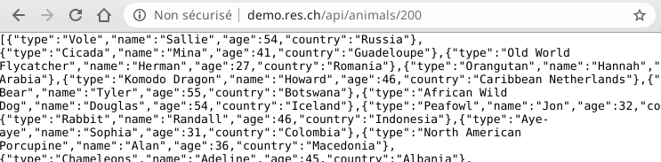

# RES - Laboratoire infrastructure HTTP

> Auteurs: Gil Balsiger et Julien Béguin  
> Date: 01.05.2020


## Step 1: Serveur HTTP statique avec NGINX

Nous avons choisi ici d'utiliser NGINX comme serveur HTTP celui étant un peu plus moderne et plus performant qu'Apache httpd.

On utilise l'instruction Dockerfile `COPY` pour copier notre site web statique dans le conteneur NGINX à l'emplacement racine du serveur web.

Nous avons utilisé un template HTML utilisant le framework CSS Bootstrap: [https://getbootstrap.com/docs/4.4/examples/](https://getbootstrap.com/docs/4.4/examples/).

Le Dockerfile est disponible [ici](Step_1/Dockerfile).


## Step 2: Serveur HTTP dynamique avec [NestJS](https://nestjs.com/)

Nous avons choisi dans cette étape d'utilisé NestJS au lieu de Express JS. NestJS est un framework inspiré d'Angular mais fonctionnant coté serveur à l'instar d'Angular qui, lui, fonctionne coté client.

Le code de l'application ainsi que le Dockerfile sont disponibles [ici](Step_2).

On peut build et lancer l'image avec les commandes suivantes: 
```
docker build -t http-step2 ./Step_2 
docker run --rm -p 3000:3000 http-step2
```

L'application permet de générer aléatoirement 20 animaux à l'adresse [http://localhost:3000/](http://localhost:3000/).

L'application permet également de générer aléatoirement un nombre spécifique d'animaux en mettant le nombre voulu dans l'URL: [http://localhost:3000/200](http://localhost:3000/200) pour générer 200 animaux.


## Step 3: Reverse proxy avec NGINX (configuration statique)

Pour cette étape, nous avons utilisé NGINX pour opéré en tant que reverse proxy.

### Configuration

Nous commençons pas construire et démarrer les containers des serveur HTTP statique et dynamique :

```bash
docker build -t http-step1 ./Step_1
docker run -d --rm --name http-step1 http-step1

docker build -t http-step2 ./Step_2
docker run -d --rm --name http-step2 http-step2
```

On utilise la commande *docker inspect* pour récupéré l'IP interne des deux containers :

```bash
docker inspect http-step1 | grep IPAddress			# 172.17.0.2
docker inspect http-step2 | grep IPAddress			# 172.17.0.3
```

On défini ensuite l'IP des backends dans la configuration NGINX :

```nginx
server {
    listen 80;

    location / {
        deny all;
    }
}

server {
    listen 80;
    server_name demo.res.ch;
    
    location / {
        proxy_pass http://172.17.0.2/;
    }

    location /api/animals/ {
        proxy_pass http://172.17.0.3:3000/;
    }
}
```

Puis on démarre un container NGINX avec la configuration créé, en forwardant le port 80 :

```bash
docker run -d --rm --name http-step3 -p 80:80 \
-v "${PWD}/Step_3/nginx-reverse.conf:/etc/nginx/conf.d/default.conf" nginx:latest
```

Il ne nous reste plus qu'à ajouter la ligne suivante dans notre fichier `/etc/hosts` pour pouvoir accéder au reverse proxy avec l'hôte **demo.res.ch**.

```
127.0.0.1		demo.res.ch
```

Et voilà ! Nous pouvons maintenant accéder à notre serveur statique à travers le reverse proxy avec http://demo.res.ch et le serveur dynamique avec http://demo.res.ch/api/animals. On peut toujours demander plus d'animaux par exemple: [http://demo.res.ch/api/animals/100](http://demo.res.ch/api/animals/100) pour demander 100 animaux.

### Remarques

#### Faiblesse de la configuration

Cette configuration statique est évidement très fragile pour la simple et bonne raison que nous avons hardcode l'IP des backends dans la configuration NGINX. Sachant que les IPs des containers sont attribués par docker et ne sont donc pas fixes, l'infrastructure peut se casser à chaque redémarrage de container. Il ne faut donc pas utiliser de tel configuration en production.

#### Point d'entrée unique

Dans un environnement de production, l’intérêt d'un reverse proxy est de n'avoir qu'un seul point d'entrée dans l'infrastructure. Cela permet de mieux contrôler le trafic et donc de protéger les serveurs backend. Il est toutefois nécessaire de configurer un pare-feu pour que les serveurs ne soit pas accessible directement.

Sur notre environnement, docker est installé directement sur nos machines (linux) est donc tous les réseaux docker sont accessible depuis l'hôte. Cela a comme conséquence qu'il est toujours possible d'accéder au serveurs web backend avec leur adresse IP (http://172.17.0.2 et http://172.17.0.3:3000).

### Alternative avec Docker Compose

Docker Compose permet de lancer plusieurs conteneurs avec une seule ligne de commande. Il permet également de gérer plus facilement l'interaction entre les différents conteneurs grâce à un réseau bridge Docker. Cela permet entre autre d'utiliser les noms des conteneurs à la place de leur adresse IP car à l'intérieur d'un réseau bridge Docker, celui-ci fourni une résolution DNS des noms des conteneurs ([Documentation Docker sur les réseaux](https://docs.docker.com/network/bridge/#differences-between-user-defined-bridges-and-the-default-bridge)).

On défini alors un `docker-compose.yml` dans `Step_3` comme suit :
```yaml
version: "3.2"
services:
    static-web:
        build: ../Step_1
    dynamic-web:
        build: ../Step_2
    reverse-proxy:
        image: nginx:latest
        ports:
            - "80:80"
        volumes:
            - "./nginx-reverse-dc.conf:/etc/nginx/conf.d/default.conf"
```

On peut ensuite utiliser les noms des conteneurs dans notre configuration NGINX à la place des adresses IP :
```nginx
server {
    listen 80;

    location / {
        deny all;
    }
}

server {
    listen 80;
    server_name demo.res.ch;

    location / {
        proxy_pass http://static-web/;
    }

    location /api/animals/ {
        proxy_pass http://dynamic-web:3000/;
    }
}
```

On démarre notre infrastructure avec :
```
docker-compose -f Step_3/docker-compose.yml up
```

La configuration reste tout de même statique et il faudra toujours modifier la configuration de NGINX lorsque l'on souhaite rajouter un nouveau conteneur à notre infrastructure. Mais elle a l'avantage de gérer dynamiquement la résolution des conteneurs dans la configuration NGINX et plus besoin d'utiliser d'adresse IP susceptible de changer.


## Step 4: Requêtes AJAX en JavaScript

Avec le temps, il devenu plus aisé de faire des requêtes AJAX en vanilla JavaScript avec l'API Fetch et les promesses.

C'est pourquoi nous n'avons pas utilisé jQuery, qui est certe toujours utilisé mais l'est de moins en moins et tant à être remplacé par des frameworks tels que React ou Vue basés sur du virtual DOM plutôt que manipuler la DOM HTML directement.

Il est possible de tester l'application sur l'URL: [http://demo.res.ch](http://demo.res.ch) après avoir lancé l'infra comme indiqué à l'étape 3

Le script est relativement simple. On récupère 1 animal et on remplace le texte du titre. On fait cela toutes les 2.5 secondes.

Le code de `app.js` est le suivant:
```javascript
let title = document.getElementById("site-title");

updateTitle();
setInterval(updateTitle, 2500);

function updateTitle() {
    let result = fetch("/api/animals/1");
    result
        .then((response) => response.json())
        .then((data) => {
            let animal = data[0];
            title.innerText = animal.name + " is a " + animal.type;
        })
        .catch(function () {
            title.innerText = "No animal";
        });
}
```


## Step 5: Reverse proxy dynamique

Pour cette étape, nous avons choisi d'utiliser **Traefik**, un puissant reverse proxy écrit en Go qui est particulièrement bien adapter aux infrastructure utilisant docker. En effet, une fois bien configuré, traefik gérera automatiquement la découverte des containers de notre infrastructure.

### Configuration

Pour pleinement profiter de la puissance de traefik, nous allons utiliser docker-compose pour créer nos container. Voici à quoi correspond notre configuration de base :

```yaml
version: "3.8"
services:
  static-web:
    build: ./Step_1/
    container_name: static-web
  dynamic-web:
    build: ./Step_2/
    container_name: dynamic-web
```

Nous ajoutons ensuite un container traefik (disponible sur hub.docker.com) :

```yaml
  reverse-proxy:
    image: traefik
    container_name: reverse-proxy
    ports:
    - "80:80"
```

Puis, nous pouvons maintenant configurer notre reverse proxy pour qu'il fonctionne comme nous le souhaitons. Pour cela, nous avons plusieurs options :

1. Écrire un fichier de configuration *traefik.toml*
2. Intégrer la configuration directement dans le fichier *docker-compose.yml* à l'aide de **labels**

Nous avons choisi la deuxième option.

#### Configuration générale de traefik

Pour commencer, il faut donner au container traefik quelques configuration pour lui indiquer quoi faire. Pour cela, nous allons lui passer des paramètres avec le mot-clé *command* dans le docker-compose.yml :

Premièrement, nous allons indiquer à traefik que docker fournira les backends. Pour que traefik puisse avoir accès au containers, il faut lui donné le droit de lire sur le socket docker.

```yaml
command:
- "--providers.docker=true"
volumes:
- /var/run/docker.sock:/var/run/docker.sock:ro
```

Ensuite, on précise qu'on ne veut pas que tout les containers soit exposé par défaut sur le reverse proxy. Nous allons les configurer nous-même.

```yaml
command:
- "--providers.docker.exposedbydefault=false"
```

Enfin, on spécifie le port utilisé pour le frontend :

```yaml
command:
- "--entrypoints.web.address=:80"
ports:
- "80:80"
```

Optionnellement, on peut activer l'interface web de traefik qui peut être pratique pour debugger :

```yaml
command:
- "--api.insecure=true"
ports:
- "8080:8080"
```

#### Configuration du RP pour le serveur HTTP statique

Premièrement, nous indiquons à traefik que nous voulons exposer ce container sur le reverse proxy :

```yaml
labels:
- "traefik.enable=true"
```

Ensuite, nous définissons la règle de routage. Dans notre cas, il suffit que l'hôte soit *demo.res.ch* :

```yaml
labels:
- "traefik.http.routers.static-web.rule=Host(`demo.res.ch`)"
```

Nous précisons quel point d'entré du reverse proxy doit être utilisé. Nous avons créé l'entrypoint "web" lors de la configuration générale de traefik.

```yaml
labels:
- "traefik.http.routers.static-web.entrypoints=web"
```

Enfin, nous indiquons sur quel port doivent être dirigées les requêtes sur ce container.

```yaml
labels:
- "traefik.http.services.static-web.loadbalancer.server.port=80"
```

#### Configuration du RP pour le serveur HTTP dynamique

La configuration pour ce container est similaire que pour le serveur HTTP statique à l'exception que nous ne voulons router que les requêtes commençant par **/api/animals**. 

Pour cela, nous allons ajouter une règle  *PathPrefix* :

```yaml
labels:
- "traefik.http.routers.dynamic-web.rule=Host(`demo.res.ch`) && PathPrefix(`/api/animals`)"
```

Dans l'état, le reverse proxy va envoyer la requête `demo.res.ch/api/animals` au backend. Ce n'est pas exactement ce que nous voulons. Il nous faut donc modifier la requête pour enlever  "*/api/animals*" avant de l'envoyer au backend. Pour cela, nous allons utiliser un **middleware** :

```yaml
labels:
- "traefik.http.routers.dynamic-web.middlewares=dynamic-web-middleware"
- "traefik.http.middlewares.dynamic-web-middleware.stripprefix.prefixes=/api/animals"
```

La première ligne permet d'indiquer à notre routeur qu'on veut utiliser un middleware et la deuxième ligne enlève le préfixe "/api/animals" de la requête. 

### Validation

Et voilà ! C'est (déjà) terminé. La configuration complète est disponible dans le fichier `docker-compose.yml`. Nous pouvons maintenant tester notre infrastructure en exécutant la commande :

```bash
docker-compose -f Step_5/docker-compose.yml up
```


http://demo.res.ch :


http://demo.res.ch/api/animals/100 :




## Step 6 : Load balancing - multiple server nodes

### Configuration du load balancer

Avec la configuration de traefik mis en place lors de la dernière étape, il est très simple de réaliser cette étape. En effet, traefik fait par défaut du load balancing. Il suffit de définir plusieurs serveurs backend pour un même service et traefik s'occupera de répartir la charge.

Ainsi nous allons légèrement modifier notre fichier docker-compose.yml pour créer plusieurs instances des deux type de serveurs backend. Pour cela, nous pourrions simplement copier-coller la configuration pour ajouter des instances mais nous allons plutôt utiliser la méthode *replicas* normalement réservé au serveur docker swarm.

Ainsi, dans le fichier docker-compose.yml, on ajoute les lignes suivantes au deux services backend :

```yaml
deploy:
  replicas: 2
```

Cela permet de créer 2 instance du même service. Il faut également supprimer la balise *container_name* car plusieurs containers ne peuvent pas avoir le même nom.

Et voilà, la configuration est déjà finie. Cela fonctionne car les 2 containers dupliqué ont le même *http.service* ce qui indique à traefik qu'il peut répartir la charge sur ces 2 instances.


Nous pouvons tester notre configuration avec la commande suivante :

Nous allons démarrer notre infrastructure avec le paramètre `--compatibility` qui permet de prendre en comptes les balises normalement réservé à swarm (balise *deploy*) :

```bash
docker-compose --compatibility up -d
```

Les 5 containers démarrent et le site s'affiche normalement mais nous avons un problème. Il nous est impossible de test si le load balancer fonctionne correctement car nous ne pouvons pas identifier quel serveur backend à répondu à notre requête. Le reverse proxy fait trop bien son travail.

Nous allons modifier nos serveurs http statique et dynamique pour qu'ils affichent le nom de l'hôte sur la page web.


### Identification d'hôtes - serveur http dynamique

Dans le fichier **Step_2/src/app.service.ts**, on ajoute un champs **hostname** :

```javascript
{
    type: chance.animal(),
    name: chance.first(),
    age: chance.age(),
    country: chance.country({ full: true }),
    hostname: require("os").hostname()
}
```

Puis dans le fichier **Step_1/src/app.js**, on affiche le **hostname** :

```javascript
let dynamic_host = document.getElementById("dynamic-host");
...
dynamic_host.innerText = "Dynamic host: " + animal.hostname;
```


### Identification d'hôtes - serveur http statique

Contrairement au serveur http dynamique, il n'y pas de façon rapide d'afficher le nom d'hôte car le serveur http statique ne contient pas de code qui est exécuté sur le serveur. Pour contourner cela nous allons utiliser php comme moteur de template pour imprimer le nom de l'hôte dans le fichier html.

Premièrement, il faut renommer le fichier index.html en index.php et ajouter la balise php suivante pour imprimer le nom d'hôte du serveur :

```php+HTML
Static host: <?=file_get_contents("/etc/hostname"); ?>
```

Ensuite, il nous faut un moyen pour exécuter la commande `php index.php > index.html` au lancement du container. Pour cela, nous allons créer le script **start.sh** qui contiendra cette commande suivi de la commande permettant de démarrer nginx. Cette dernière est nécessaire car nous allons écraser l'instruction CMD de l'image de base nginx avec notre script. On peut trouver cette commande à la fin du [Dockerfile de l'image nginx](https://github.com/nginxinc/docker-nginx/blob/594ce7a8bc26c85af88495ac94d5cd0096b306f7/mainline/buster/Dockerfile#L103).

```bash
#!/bin/bash
php /usr/share/nginx/html/index.php > /usr/share/nginx/html/index.html
nginx -g 'daemon off;'
```

Pour terminer, il faut modifier le Dockerfile pour installer php et pour copier et exécuter le script **start.sh** au lancement du container : 

```dockerfile
FROM nginx

LABEL authors="Gil Balsiger, Julien Béguin"

RUN apt-get update && apt-get install -y php

COPY src /usr/share/nginx/html
COPY start.sh /usr/local/bin/start.sh

CMD ["/bin/bash", "/usr/local/bin/start.sh"]
```


### Validation

On démarre notre infrastructure avec la commande suivante pour force la reconstruction des images :

```bash
docker-compose --compatibility up -d --build
```

Et on peut maintenant voir les deux noms d'hôte en haut à gauche de la page web. Le hostname dynamique change toutes les 3 secondes et le hostname statique change quand on recharge la page (attention au cache) :


## Step 7 : Load balancing : round-robin vs sticky sessions

### Protocole de validation

Les navigateurs ne sont pas une façon fiable de tester notre infrastructure. En effet, sur chrome et firefox, le même nom d'hôte est répété plusieurs fois même en faisant un CTRL+F5. Il faut appuyer deux fois sur CTRL+F5 rapidement ou alors activer l'option *Inspecter > Network > Disable cache* pour que l'hôte change à chaque fois. Les navigateurs utilise donc du cache même quand on leurs dis de pas l'utiliser. Cela rend les tests délicats. 

Pour éviter cela, nous allons plutôt faire nos tests avec curl. Nous écrirons deux scripts pour nous permettre de tester individuellement chaque service. 

#### Scripts de validation

Premièrement, il nous faut construire une commande pour faire une requête HTTP sur la ressource à tester et n'afficher que le nom d'hôte ayant répondu.

Contenu dynamique :

```bash
curl -b cookies.txt -s demo.res.ch/api/animals/1 | cut -d '"' -f18
```

Contenu statique :

```bash
curl -b cookies.txt -s demo.res.ch | grep "Static host" | cut -d ':' -f2 | cut -c2-
```

L'option `-b` de `curl` permet de spécifier les cookies à envoyé pour la requête. Cela sera utile lors du test des sticky sessions.


Ces requêtes seront exécutées dans une boucle pour pouvoir évaluer si le load balancer distribue correctement les requêtes. Ainsi, mise à part les *endpoints* et les requêtes ci-dessus, les deux scripts sont identiques et ressemblent à cela :

**test-static.sh** :

```bash
#!/bin/bash

COOKIE_FILE=.cookies.tmp~
REQUEST_FILE=.requests.tmp~
ENDPOINT=demo.res.ch

printf "COOKIES:\n"
curl -c $COOKIE_FILE -s $ENDPOINT > /dev/null
tail -n +5 $COOKIE_FILE
touch $REQUEST_FILE

printf "\nREQUESTS:\n"
for i in {1..20}
do
    printf "%2d. " $i
	curl -b $COOKIE_FILE -s $ENDPOINT | grep "Static host" | cut -d ':' -f2 | cut -c2- | tee -a $REQUEST_FILE
done

printf "\nSUMMARY:\n"
cat $REQUEST_FILE | sort | uniq -c | tr -s ' ' ' ' | cut -c2-

rm $REQUEST_FILE $COOKIE_FILE
```

Les actions suivantes sont effectuées :

1. Fait une première requête sur le service à tester pour recevoir les cookies et les enregistrer dans un fichier temporaire
2. Affiche les cookies enregistrés 
3. Effectue 20 requête sur le service à tester avec le cookie enregistrer en affichant uniquement le nom d'hôte du serveur backend ayant répondu
4. Affiche un résumé comptabilisant le nombre de fois que chaque serveurs a été atteint.

Ainsi les scripts `test-static.sh` et `test-dynamic-sh` nous permettent de tester notre configuration round robin ainsi que notre future configuration sticky session qui utilisera les cookies pour maintenir les sessions.


### Round robin

Le load balancer de traefik distribue les requête de façon round robin par défaut.


### Sticky sessions